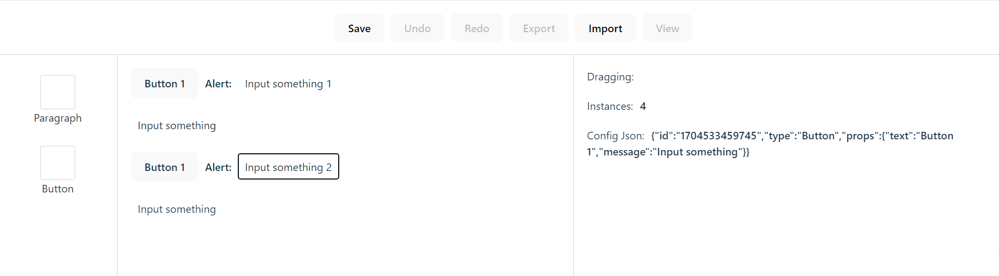

# Drag & Drop Pet Project

## Demo
* **Admin Page**


* **Consumer Page**


## Setup

Clone project and run example.

```
$ git clone https://project_url_clone
$ cd <project_dir>
$ npm install or yarn install
$ npm dev or yarn dev
```

### About Project

Author: Vinh Nguyễn

Description: a flexible web application to present quick content advertising by drag and drop components to build page sites, project includes features such as:
* **Edit: edit inline directly on component**
* **Save: enable when there are changes**
* **Undo & Redo: enable when saved**
* **Export: enable when saved, export data as .json file**
* **Import: import .json file**
* **View: redirect to consumer page**

Thanks for watching!
